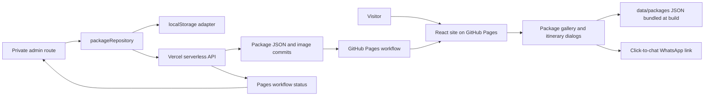

# Project handover

This guide gives a new maintainer a map of TrippyGo and links to the operational details. Keep deployment secrets out of this repository; provider setup is documented without secret values.

## Product scope

TrippyGo is a travel package discovery and enquiry website. Visitors can browse India and international trips, filter by region/category/tags/Couples, view itineraries and price options, and start a WhatsApp conversation. The site does not take payments, create confirmed bookings, or automatically send WhatsApp messages.

The admin manages package content and ordering. Production admin changes are committed to the configured GitHub branch and trigger a Pages build. Local admin changes are browser-only and do not publish.

## System overview



## Important code areas

| Area                                | Purpose                                                                                   |
| ----------------------------------- | ----------------------------------------------------------------------------------------- |
| `src/App.tsx`                       | Landing page sections and optional admin route.                                           |
| `src/components/Packages.tsx`       | Package filters, fare choices, detail dialog, and WhatsApp enquiry.                       |
| `src/data/packages.ts`              | Eagerly loads `data/packages/*.json`, removes duplicate IDs, sorts packages, formats INR. |
| `data/packages/*.json`              | One package record per file; source for the public catalog.                               |
| `src/admin/AdminApp.tsx`            | Admin login UI, package list/editor, ordering, uploads, and deployment status.            |
| `src/admin/packageValidation.ts`    | Client-side package draft validation.                                                     |
| `src/services/packageRepository.ts` | Local/API boundary for admin package operations and auth.                                 |
| `src/types.ts`                      | Shared TypeScript models, especially `TourPackage`.                                       |
| `api/`                              | Vercel function entrypoints.                                                              |
| `serverless/contentHandler.ts`      | Shared API auth, validation, CORS, GitHub file operations, and Pages status lookup.       |
| `scripts/prerender.mjs`             | Build-time rendering of the homepage/package catalog for crawlers.                        |
| `scripts/prerender-router.tsx`      | Supplies the same React Router instance to the prerender module graph.                    |
| `.github/workflows/deploy.yml`      | Builds and deploys `dist` to GitHub Pages on pushes to `main`.                            |

## Package data and pricing rules

The `TourPackage` interface in `src/types.ts` is the contract for JSON, admin forms, and API operations. When adding fields, update the model, admin form, client validation, server validation, and card/detail display together.

- `price`: starting price per person; `null` means “On request.”
- `flightIncludedPrice`: optional flights-included rate per person.
- `forCouples`: enables the Couples filter.
- `coupleStartingPrice`: total starting amount for two travellers, not a per-person rate.
- `region`, `category`, `tags`: determine gallery filter membership.
- `rateNote`: disclose occupancy, validity, and exclusions alongside a rate.
- `displayOrder`: lower values appear first.
- `itinerary`: should contain one item for each `days` value.

Displayed prices are indicative. Confirm operational availability, taxes, dates, occupancy, flights, and inclusions before confirming a booking.

## Admin and API flow

The admin route is only registered if `VITE_ADMIN_ROUTE` is configured. The route is obscurity, not authentication; production access also requires `ADMIN_PASSWORD` and a valid signed HTTP-only session cookie.

Local mode (`VITE_LOCAL_ADMIN=true`) stores admin data/session in that browser's `localStorage`. Production mode uses `VITE_CONTENT_API_URL`; the API uses a fine-grained GitHub token to read or commit package JSON and image files. The production session cookie expires after 12 hours. `ALLOWED_ORIGIN` must exactly match the website origin for credentialed CORS.

The API exposes:

| Method   | Route                        | Purpose                                               |
| -------- | ---------------------------- | ----------------------------------------------------- |
| `GET`    | `/api/auth/session`          | Check the current admin session.                      |
| `POST`   | `/api/auth/login`            | Verify the admin password and issue a session cookie. |
| `POST`   | `/api/auth/logout`           | Clear the session cookie.                             |
| `GET`    | `/api/packages`              | Read the catalog for authenticated admin use.         |
| `POST`   | `/api/packages`              | Create a package and upload its cover image.          |
| `GET`    | `/api/packages/:id`          | Read one package.                                     |
| `PUT`    | `/api/packages/:id`          | Update a package and optional image.                  |
| `DELETE` | `/api/packages/:id`          | Delete a package.                                     |
| `POST`   | `/api/packages/order`        | Save package order.                                   |
| `GET`    | `/api/deploy/status?sha=...` | Read Pages workflow status for a commit.              |

The public site bundles package JSON at build time; it does not query the API for its catalog. A production admin edit commits to GitHub, which triggers the Pages workflow so the updated JSON is bundled into the next site build.

## Build and quality checks

Use Node.js 22.13 or later. The usual validation sequence is:

```sh
npm ci
npm run check
npm run build
```

`npm run check` runs TypeScript, ESLint, Prettier, and the Vitest unit tests. `npm run build` runs those checks, builds with Vite, then prerenders the homepage and package cards. Unit tests cover package sorting, INR formatting, and package draft validation; UI, browser, and API integration tests are not configured yet.

## Known boundaries and follow-up areas

- WhatsApp is click-to-chat only; there is no WhatsApp Business API, inbound webhook, or delivery tracking.
- There is no checkout, payment, booking database, or customer account system.
- Images are stored in the repository and are limited to 3 MB per admin upload. Move them to object storage/CDN if repository growth or deployment size becomes a problem.
- The admin uses a shared password rather than individual accounts/roles. Do not treat a private route as access control.
- GitHub Pages and Vercel default domains can be cross-site for cookies. A custom website/API sibling-domain setup is documented separately.
- The sitemap currently lists the homepage because package details are dialogs, not distinct crawlable routes.

## Maintainer docs

- [Local development](local-development.md)
- [Code standards](code-standards.md)
- [Admin and package flow](admin-operations.md)
- [Deployment runbook](deployment-runbook.md)
- [Vercel setup](vercel-setup.md)
- [Custom domain setup](custom-domain-setup.md)
- [Hosting and scaling](hosting-and-scale.md)
